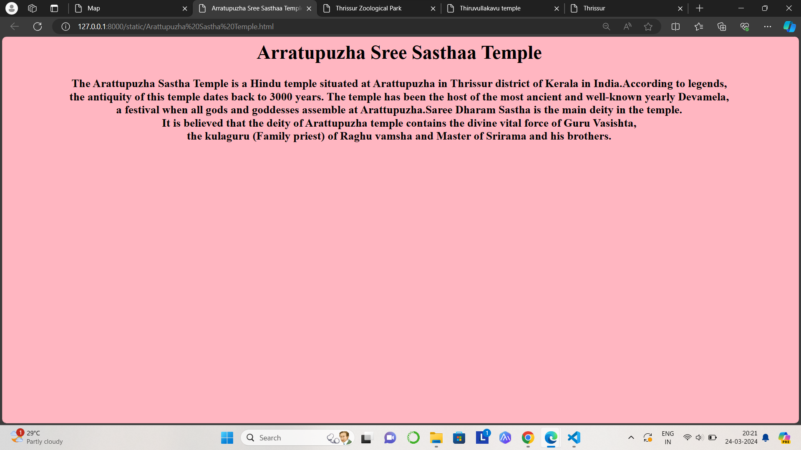

# Ex04 Places Around Me
## Date: 25.03.2024 

## AIM
To develop a website to display details about the places around my house.

## DESIGN STEPS

### STEP 1
Create a Django admin interface.

### STEP 2
Download your city map from Google.

### STEP 3
Using ```<map>``` tag name the map.

### STEP 4
Create clickable regions in the image using ```<area>``` tag.

### STEP 5
Write HTML programs for all the regions identified.

### STEP 6
Execute the programs and publish them.

## CODE:

### Map:
```
<html>
<html lang="en">
<head>
    <title>Map</title>
</head>
<body align="center">
    <h1>
        <font color="red"><b>Thrissur</b></font>
    </h1>
    <h2>
        <font color="Blue"><b>Rajalakshmi R</b></font> 
    </h2>
    <h3>
        <font color="black"><b>Reg no : 212223110037 </b></font>
    </h3>
<!-- Image Map Generated by http://www.image-map.net/ -->


<map name="image-map">
    <area target="_blank" alt="Arattupuzha Sree Sastha Temple" title="Arattupuzha Sree Sastha Temple" href="Arattupuzha Sastha Temple.html" coords="1204,937,950,805" shape="rect">
    <area target="_blank" alt="Thrissur Zoological Park" title="Thrissur Zoological Park" href="Thrissur zoological Park.html" coords="1637,383,1364,255" shape="rect">
    <area target="_blank" alt="Thiruvullakkavu Temple" title="Thiruvullakkavu Temple" href="Thiruvullakavu temple.html" coords="938,683,111" shape="circle">
    <area target="_blank" alt="Triprayar" title="Triprayar" href="Tripayar.html" coords="141,839,289,833,291,931,149,921" shape="poly">
    <area target="_blank" alt="Thrissur center" title="Thrissur center" href="Thrissur Center.html" coords="1024,92,128" shape="circle">
</map>
</body>
</html>
```

### place 1 (Thrissur center)
```
<html>
	<head>
		<title> 
            Thrissur center
        </title>
	</head>
	<body bgcolor="lightgray">
		<h1 align="center">Thrissur Center</h1>
        <h3 align="center">Thrissur is also known as the cultural capital of Kerala because of its cultural, spiritual and religious leanings throughout history.
        <br>The city hosts the Thrissur Pooram festival, the most colourful and spectacular temple festival in Kerala.
        <br>The festival is held at the Thekkinkadu Maidan of Vadakumnathan Temple in April or May , in the Malayalam month 'mesam'.
	</body>
</html>
```

### place 2 (Thiruvullakavu Temple)
```
<html>
	<head>
		<title> 
            Thiruvullakavu temple
        </title>
	</head>
	<body bgcolor="lightblue">
		<h1 align="center" >Thiruvullakavu Temple</h1>
        <h3 align="center">The Thuiruvullakkavu Sree Dharma Sastha Temple is a Hindu temple located in Cherpu of Thrissur district of Kerala.
        <br>The deity is Lord Dharma Shastha in standing posture with arch and a bow. An enchanting shrine in the midst of a dense forest, 
        <br>a gusher of beneficent spirit-that was the temple of Thiruvullakkavu, centuries back.
	</body>
</html>
```

### palce 3 (Thrissur Zoological Park)
```
<html>
	<head>
		<title> 
            Thrissur Zoological Park
        </title>
	</head>
	<body bgcolor="lightyellow">
		<h1 align="center">Thrissur Zoological Park</h1>
        <h3 align="center">Thrissur Zoological Park Wildlife Conservation & Research Centre, commonly known as Puthur Zoological Park is an under construction zoological park situated at Puthur,
        <br>near Ollur in the city of Thrissur of the South Indian state of Kerala.It will be India's first designer zoo and is also touted as one of the largest zoos in Asia.
        <br>It will be the first zoo in the state which will be developed and managed by the Kerala Forest and Wildlife Department. 
        <br>The zoo compound includes a natural history museum and an art museum that showcase the social and cultural heritage of the region</h3>
	</body>
</html>
```

### place 4 (Arratupuzha Sree Sastha Temple)
```
<html>
	<head>
		<title> 
            Arratupuzha Sree Sasthaa Temple
        </title>
	</head>
	<body bgcolor="lightpink">
		<h1 align="center">Arratupuzha Sree Sasthaa Temple</h1>
        <h3 align="center">The Arattupuzha Sastha Temple is a Hindu temple situated at Arattupuzha in Thrissur district of Kerala in India.According to legends, 
        <br>the antiquity of this temple dates back to 3000 years. The temple has been the host of the most ancient and well-known yearly Devamela, 
        <br>a festival when all gods and goddesses assemble at Arattupuzha.Saree Dharam Sastha is the main deity in the temple.
        <br>It is believed that the deity of Arattupuzha temple contains the divine vital force of Guru Vasishta, 
        <br>the kulaguru (Family priest) of Raghu vamsha and Master of Srirama and his brothers.</h3>
	</body>
</html>
```

### Place 5 (Tripayar)
```
<html>
	<head>
		<title> 
            Tripayar
        </title>
	</head>
	<body bgcolor="violet">
		<h1 align="center">Tripayar</h1>
        <h3 align="center">Thriprayar is a town in Thrissur District of Kerala, India. It is famous for the Thriprayar Temple.
        <br>It is a part of Thrissur Metropolitan Area. It has one of the 4 temples which is visited in Nalambalam Yatra.The Thriprayar Temple was 
        <br>originally under the domain of the Zamorins, rulers of Calicut. It later came under the possession of the Dutch,
        <br>then Mysore Sultans and the rulers of Cochin.Now it is one of the several temples governed by Cochin Devaswom Board.</h3>
	</body>
</html>
```

## OUTPUT :
### Map


### place 1 (Thrissur Center)


### place 2 (Thiruvullakavu Temple)


### place 3 (Thrissur zoological park)


### place 4 (Arratupuzha Sree Sastha temple)


### place 5 (Tripayar)


## RESULT
The program for implementing image maps using HTML is executed successfully.
